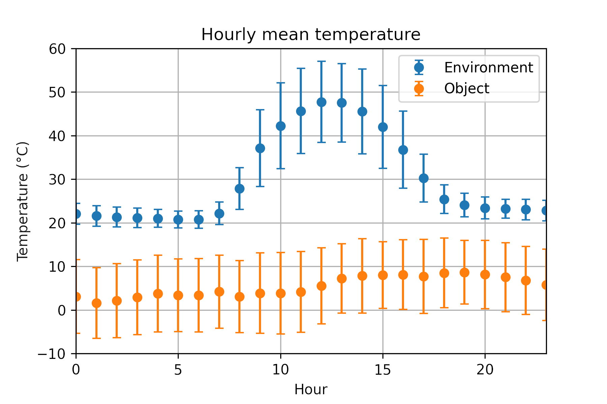

# Infrared sensor using Arduino

Clouds have a significant effect on the planet's climate. They serve not only as a cover to the surface deflecting sunlight back to space. But also as an intermediate layer for infrared radiation from the ground.

In this project, an infrared sensor is mounted to an Arduino board and used to measure the temperature of cloud bases. By measuring their temperature, we can calculate the total irradiance from clouds and thus estimate their effect on the surface temperature and local weather. It is crucial to create models and make accurate predictions about the climate.

## Getting started

All the Arduino code written for this project is available in this repository. Installing the correct Arduino IDE plugins for the ESP32 Camera and Adafruit DHT shield is necessary to compile the code correctly.

### Components

- ESP32-S AI-Thinker Camera
- MLX90614 IR Sensor
- Arduino Uno Board
- Adafruit Data Logger Shield
- SD card

## Data

The temperature data captured by the infrared sensor is stored in text files on the SD card by the Arduino shield. The files have a CSV format with time, environment, and object temperatures. All temperature measurements are in degrees Celcius.

## Analysis

Currently, we are working with the Arduino data only. It is impossible to estimate the total cloud irradiance based only on the Arduino data. Furthermore, we shall compare the data points we presently have to that taken by a high-end infrared sensor in the CIENTEC park.

## Contribuitors

- [Márcia Akemi Yamasoe](http://lattes.cnpq.br/7363881469488210) - *Supervisor*
- [Ícaro Vaz Freire](https://ivfreire.github.com) - *Intern at LRAA*

Department of Atmospheric Sciences \
Institute of Astronomy, Geophysics and Atmospheric Sciences \
University of São Paulo

## Acknowledgements

- Thanks for visiting.
